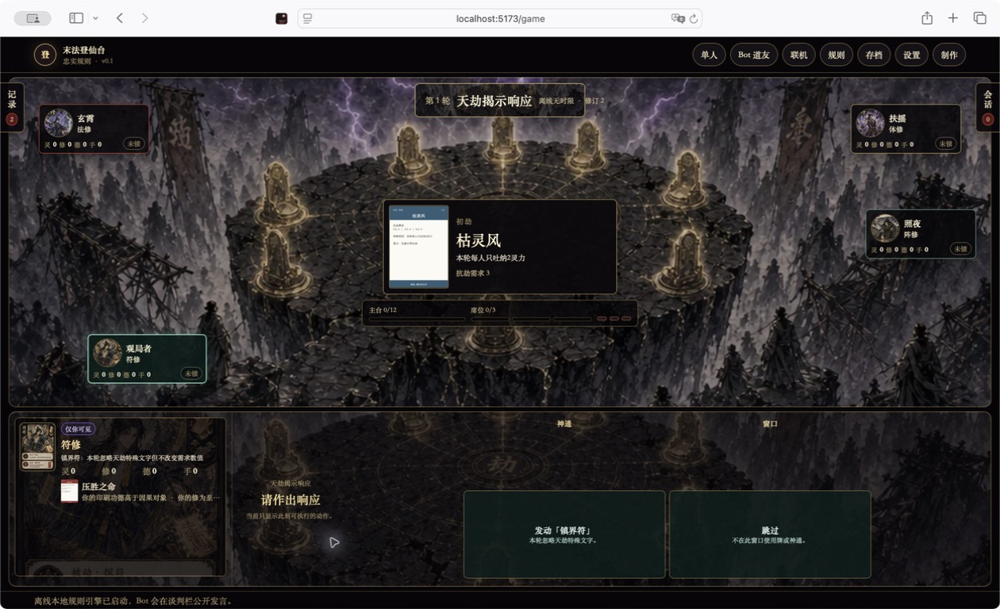
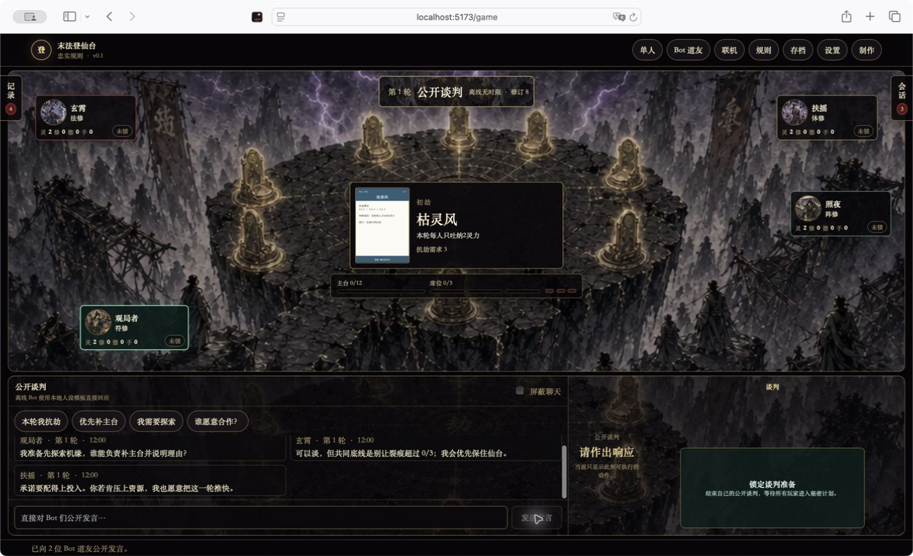
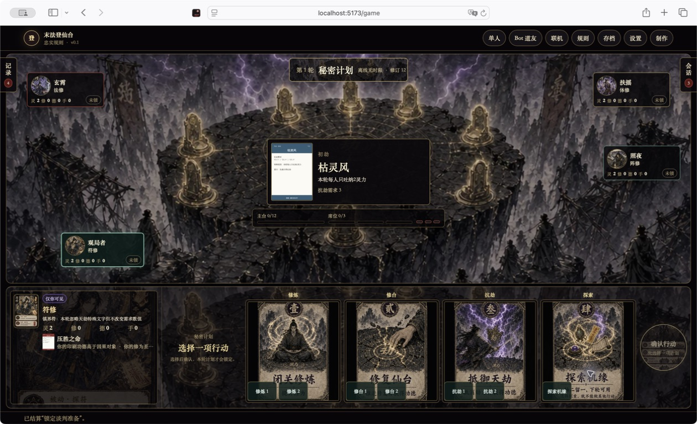
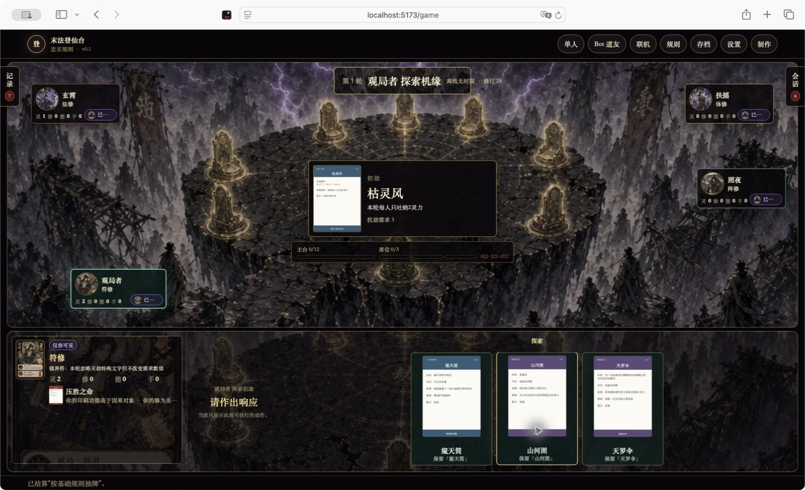
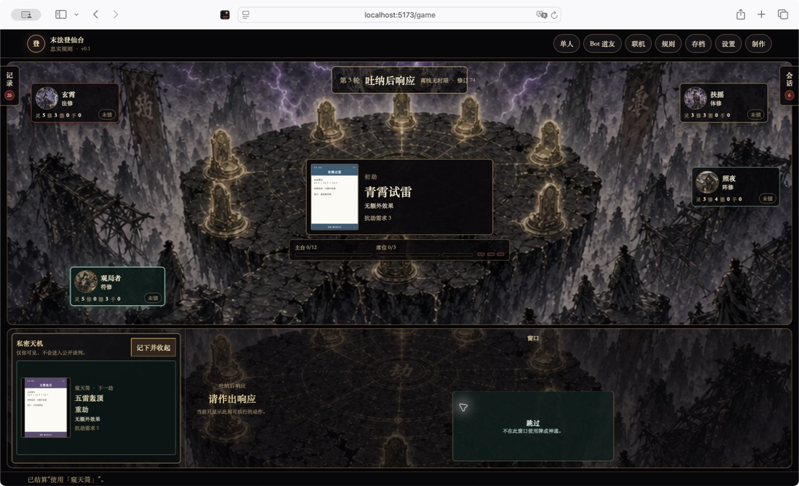

# Safari 环坛式对局审计

审计日期：2026-07-31  
环境：macOS Safari，正常浏览器窗口，1260×768  
范围：本地四人单人局、公开谈判、秘密计划、探索机缘、三轮连续结算、私密情报反馈

## 结论

环坛式桌面的主要流程已健康：中央玄坛持续展示天劫与进度，四名玩家围绕桌面分布，底部决策区只承载当前阶段。连续试玩三轮后，核心动作、Bot 公开交流、探索三选一和下一轮推进均能完成。

本轮发现并修复两项高优先级问题：

1. 秘密计划卡上的投入按钮虽达到 44px，但与大幅行动卡相比仍显得局促。桌面规则现统一提高到 52px；较窄布局保留 48px 下限。
2. 使用「窥天简」后，规则引擎已保存私密结果，界面却只显示“已结算使用”，玩家看不到下一张天劫。现在会自动打开私密天机层，显示上游天劫卡面、名称、阶段、效果和抗劫需求，并支持收起、再次查看。

## 试玩路径与健康度

1. **主菜单 → 单人配置：健康。** 主入口清晰，单人、Bot 道友、联机、规则、存档和设置均保持可见。
2. **创建本地四人局：健康。** 环坛背景、人物头像、天劫牌和公开状态同时加载；中央信息与四周玩家层级明确。
3. **自由公开发言：健康。** 玩家可输入中文发言，Bot 会在同一会话抽屉中公开回应。
4. **秘密计划：修复后健康。** 四张行动卡保留完整上游美术，投入按钮增大后仍在 1260×768 同屏显示。
5. **探索机缘：健康。** 三张候选机缘以独立卡牌画廊呈现，可直接点击卡面下方的大按钮保留。
6. **连续三轮结算：健康。** 吐纳、谈判、秘密计划、揭晓、机缘、贡献、雷击和下一轮切换均可推进。
7. **窥天简：修复后健康。** 结果只出现在当前玩家的私密区域；预览自动打开，可收起并通过“查看私密天机”再次打开。

## 视觉证据

### 环坛开局

### 自由发言与 Bot 回应

### 放大后的秘密计划按钮

### 探索卡牌三选一

### 窥天简私密天劫预览

## 优点

- 上游美术已进入关键决策点，而非只作为背景：人物、天劫、秘密行动、机缘/法宝都使用实际卡面。
- 底部阶段区会随流程切换，不需要在多个固定小窗之间寻找当前动作。
- 探索是可比较的卡牌选择，而不是纯文本菜单。
- 私密情报不会进入公开谈判或其他玩家视图，视觉反馈和规则权限一致。
- 记录与会话继续使用可关闭侧抽屉，不长期压缩环坛主视图。

## 风险与边界

- 本轮针对正常 Safari 桌面窗口做视觉与交互验收；没有声称完整 WCAG 合规，也没有覆盖全键盘流程、屏幕阅读器、200% 缩放或所有移动设备。
- 较窄响应式布局使用 48px 行动按钮，仍需在更多真实设备上复核长文案换行。
- Docker 镜像构建仍受当前 Docker Desktop registry/代理 EOF 阻塞；这不是本轮 UI 改动导致的失败。
- Playwright 未重跑，因为本轮按用户选择只使用 Safari 实机验收。
